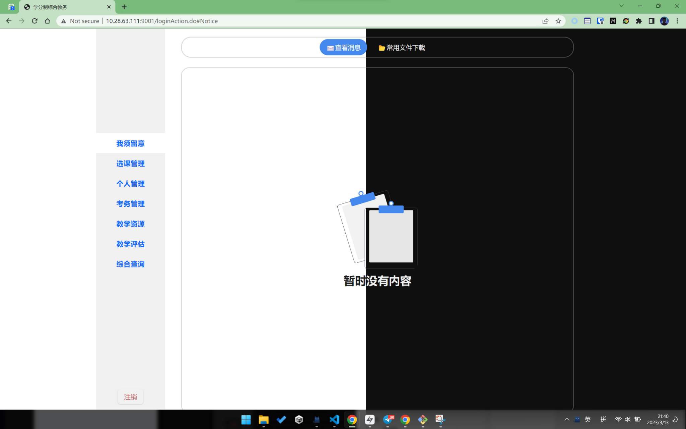
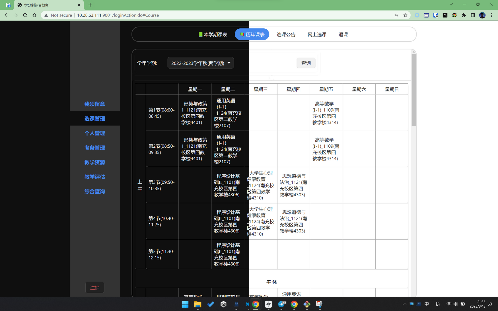

# URP 教务系统美化插件

本插件重新设计了[URP 教务系统](http://cwjf.swpu.edu.cn/)的页面，更加符合现代审美。已知使用该教务系统的学校有：

-   西南石油大学




## 使用方法 Usage

### 1. 一键安装（推荐）

使用 Chrome 或者 Edge 点击链接访问 [chrome 插件商店](https://chrome.google.com/webstore/detail/urp-beautifier/iplofmnlmkbebfbihplgjkalkbbpiapm?hl=en-US) 安装即可。

### 2. 使用油猴安装

适配中

### 3. 使用 Chrome 手动安装

如果无法打开页面，请参考以下步骤：

1. 下载 [release](https://github.com/RiverTwilight/URP-Beautifier/releases) 中的 zip 文件，解压缩。
2. 打开 Chrome 浏览器，地址栏输入 [chrome://extensions](chrome://extensions)，回车。
3. 在打开的页面中，打开右上角的 「开发者模式」 选项。
4. 点击页面上方三个按钮中第一个，加载未打包的扩展程序。
5. 选择之前解压的文件夹，完成。

### 4. 使用 Edge 手动安装

1. 下载 [release](https://github.com/RiverTwilight/URP-Beautifier/releases) 中的 zip 文件，解压缩。
2. 打开 Edge 浏览器，地址栏输入 [edge://extensions](edge://extensions)，回车。
3. 在打开的页面中，打开左侧的 「开发人员模式」 选项。
4. 点击页面上方的 「加载解压缩的扩展」。
5. 选择解压的文件夹，完成。

此处以 Chrome 和 Edge 为例，同时支持 Firefox 浏览器。

## 贡献

```bash
npm run dev
# Or
yarn run dev
```

## About

License: MIT
